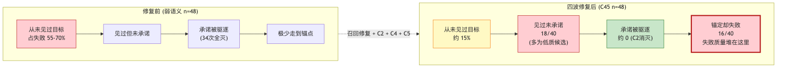
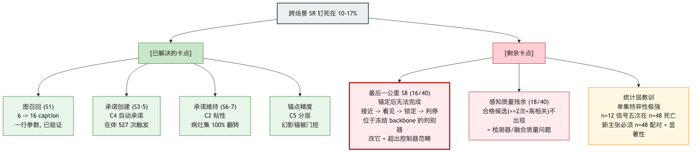

# 目前的问题与卡点在哪里（结合全部实验证据，2026-07-07）

> 前置阅读：`docs/pipeline_overview_cn_20260707.md`（S0–S9 链条定义）。
> 数据来源：约 700 个 episode 的 matched 实验（弱/强/召回修复三 regime × 10+ 变体 × n=48 配对）。

---

## 一、先说结论

**跨场景成功率（SR）被钉死在 10–17%，对所有控制器变体、所有 LLM 强度、所有修复波次都如此。** 但这不是"什么都没用"——每一波修复都在自己负责的环节真实生效，失败只是**流向了下一个环节**。我们把这个现象称为"分层瓶颈级联"：管道有五个阀门，你拧开一个，水压到下一个阀门就停。

## 二、逐环节体检表（环节 × 证据 × 状态）

| 环节 | 曾经的问题 | 修复动作 | 修复后证据 | 当前状态 |
|---|---|---|---|---|
| S0 检测 | 检测器本身在开火（capsule 显示 7 通道 1341 正像素） | 无需修 | — | ✅ 健康 |
| **S1 进图** | **整集只有 ~6 个物体进清单；chair 集整集零椅子** | 放宽节点门（1 行参数） | caption 6→16（2.5×），"从未见过目标"失败 55–70%→崩到 ~15% | ✅ 已修复（但见"代价"） |
| S2 候选识别 | — | 无需修 | 修复 S1 后候选大量涌现 | ✅ 健康 |
| S3–S5 承诺创建 | LLM 不一定选已在清单里的目标（no_anchor 15/36） | C4 自动承诺 | 在体 527 次触发；never/no_anchor 桶继续缩 | ✅ 机制生效 |
| S6–S7 承诺维持 | **34 次目标承诺全被三种驱逐器杀掉**（停滞踢出/卡死弃标/菜单毒化） | C2 承诺粘性 | 病灶集 100% 翻转（ep159、ep358）；probe SR 翻倍 4/12 | ✅ 病灶内生效 |
| 锚点精度 | 单瞥节点坐标不可靠：12/34 失败是"走到幻影锚点 1 米内" | C5 锚级分层（坐标只信≥2次检测） | 幻影锚问题被门控 | ✅ 机制生效 |
| **S8 接近/判停** | **锚定了、坐标准了，还是到不了或停不下** | **未修（当前卡点）** | C45 终局：anchored_failed 16/40 | ❌ **当前最大卡点** |
| 感知质量残余 | 部分集连"见过 2 次的合格候选"都没有 | 未修（检测器范畴） | C45 终局：detected_no_anchor 18/40 中相当部分是低质候选 | ❌ 第二卡点 |

## 三、失败都去哪了：级联可视化

*（图源：`figures/failure-cascade.mmd`，可用 mermaid 重新渲染）*

直白说：**以前是"根本不知道目标在哪"，现在是"知道在哪、也认真去了，但最后一公里完成不了"。**

## 四、为什么 SR 还是不动？三个硬原因

### 原因 1：级联吸收——失败质量守恒地流向下一层
五次 n=12→n=48 的教训完全一致：probe 上机制显灵（因为 probe 集的失败恰好是该机制的病灶），扩样后遇到病灶不同的集，总量不动。C45 终局数字：full 8/48 (0.167) vs baseline 7/48 (0.146)，p=1.0。

### 原因 2：最后一公里（S8）不归控制器管
`visible_failed = 0`——**700 个 episode 里没有一例"执行器锁定了可见目标还失败"**。反过来读：执行器的"看见→锁定→判停"链路**从未被成功触发过**（对失败集而言）。锚点只能把机器人带到目标**大概的位置**，最终 1 米内的判停靠执行器的实例判别（`instance_discriminator`），这是冻结 backbone 的部分，我们从来没碰过。anchored_failed 的 16 个集就死在这里。

### 原因 3：感知质量的天花板还在
召回修复解决了"看没看见"，没解决"看得准不准"：放宽的门带来更多但更糙的节点。detected_no_anchor 的 18 个集里，合格（≥2 次检测+高相关）候选根本没出现——这是检测器/融合质量问题，换控制策略无解。UniGoal 原文同管线的发表数字也只有 20.2%，互为佐证。

## 五、卡点全景一张图

*（图源：`figures/bottleneck-map.mmd`，可用 mermaid 重新渲染）*

## 六、这些卡点对"下一步"意味着什么

三条出路（详细讨论见对话记录，等待决策）：

1. **接受现状定稿**：论文以"分层瓶颈级联 + 四波已验证的层内修复 + 机制/成本正贡献"为主线——所有材料现成，风险最低。剩余卡点如实写进 Limitation 与 Future Work（并且我们能精确指出它们在哪一层、有多少失败质量、为什么控制器层无解——这正是审计方法学的价值证明）。
2. **攻 S8（第五波）**：修 `instance_discriminator` / 接近-判停逻辑。潜在收益：16/40 的失败质量；风险：需改冻结 backbone（比较公平性要重新论证）、2–3 周周期、且可能再次被级联吸收（成功还需要 S9 的 1 米判定配合，目标 GT 位置与节点坐标的偏差未知）。
3. **攻感知质量**：换/调检测器。收益天花板最高（两个卡点同时受益），但工程量最大、且论文性质会漂移成感知论文。

**统计红线（无论选哪条）**：所有新机制必须过"n=48 配对 + McNemar/bootstrap"才算数——这是本项目用五次教训买来的纪律。
