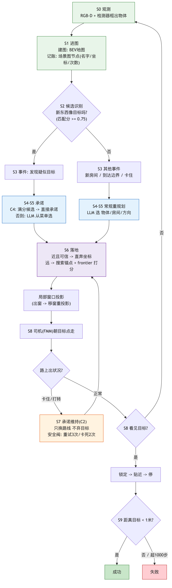

# SmoothNav Pipeline 技术总览（精确版，2026-07-07 v2）

> 配套文档：`docs/current_bottlenecks_cn_20260707.md`（各环节实验证据与卡点）。
> 本文所有参数值为当前主线配置（`config_habitat_deepseek_recall_c45.yaml` 系）；标注"默认/修复版"处给出两个值。

---

## 0. 任务定义

Text-goal navigation（HM3D v0.2 val，Habitat 模拟器）：输入一段目标实例的自然语言描述（含内在属性与周边物体），agent 在未见过的场景中导航。动作空间 {move_forward, turn_left, turn_right, stop}。**成功判定：在 T=1000 步内 stop 且距目标实例 <1.0 m**（与 UniGoal 发表协议逐项一致）。

## 1. 模块组成

| 模块 | 文件 | 职责 | 关键输出 |
|---|---|---|---|
| 语义检测 | `agent.py` `pred_sem`（Mask-RCNN，COCO→16 类；GroundedSAM 供图谱 caption） | 每帧实例分割 | `sem_seg_pred`（120×160×16）、`pred_box`、`last_semantic_instances` |
| BEV 建图 | `bev_mapping.py` `BEV_Map` | 深度点云→体素→俯视图投影 | `full_map`（720×720，36 m @5 cm；通道 0-3=obstacle/explored/agent/visited，4:20=语义）、`local_map`（240×240 局部窗）、实例 footprint（evidence-only，不写导航通道） |
| 场景图 | `graph.py` `Graph` | 检测→对象节点/房间节点/关系边 | `nodes`（caption/center/num_detections/pcd）、`room_nodes`、frontier 提取与评分、`last_goal_replay_snapshot` |
| 世界状态 | `world_state.py` | 每步汇总 pose/frontier/graph delta/executor 状态 | `WorldState`（含 object footprint、投影诊断） |
| 事件检测 | `graph_delta.py` | 相邻步图差分 | `GraphDelta.event_types` |
| 战术仲裁 | `tactical_arbiter.py` | 事件→模式（replan/recovery/hold/follow） | `TacticalDecision` |
| 高层规划 | `planner.py` `HighLevelPlanner` | LLM 菜单选择→语义策略 | `Strategy(target_region, bias_position, anchor_object, reasoning)` |
| 几何落地 | `strategy_grounding.py` `apply_strategy` | 策略→full-map 坐标→局部窗投影 | `GroundingResult`（含失败码、topk frontier 评分分解） |
| 执行适配 | `executor_adapter.py` | epoch 化封装 UniGoal 执行器 | `ExecutorCommand`/`ExecutorFeedback` |
| 低层执行 | `agent.py` `instance_discriminator`+FMM | 局部避障、可见目标锁定、判停 | Habitat action |
| 终局仲裁 | `terminal_arbitration.py` | 结局标注（6 类失败码） | `TerminalDecision` |
| 追踪 | `tracing.py` | 全链路落盘 | step_traces / planner_calls / monitor_calls / grounding_snapshots / task_frame_capsules |

## 2. 每步主循环的精确执行顺序（`main.py`，smoothnav 模式）

```
1  bev_map.mapping(rgbd, infos)                    # 建图 + 实例 footprint 投影
2  if navigate_steps % 2 == 0: graph.update_scenegraph()   # 每 2 步更新图谱
3  no_progress 计数更新（位移 < 0.05 格判定）
4  graph_delta = build_graph_delta(...)             # 事件集计算
5  world_state = world_builder.build(...); belief 更新; budget 更新
6  tactical_decision = tactical_arbiter.decide(...)
7  事件重规划分支（target_candidate_detected / new_room_discovered）：
     ├─ C4: maybe_auto_commit_target()  满足条件 → 确定性承诺（跳过 LLM）
     └─ 否则 plan_strategy_budgeted()   LLM 菜单选择
8  monitor（若 profile 启用且 arbiter 要求）→ CONTINUE/ADJUST/PREFETCH/ESCALATE
9  maybe_promote_pending()                          # 更具体的 pending 提前晋升
10 C4 standing 检查: maybe_auto_commit_target()     # 覆盖"老节点跨过锚级门"场景
11 handle_frontier_reached()                        # 到边界的多路分支（含 C2 保护）
12 auto-prefetch（接近边界时预取下一策略）
13 handle_stuck_replan()                            # 卡死（C2: 保目标换路径）
14 handle_out_of_local_window()                     # 出窗修复（移窗+重投影）
15 handle_grounding_failure()                       # 连续 noop≥2 / 同 frontier≥2 → 重规划
16 executor_adapter.build_command + step            # epoch/temp-goal 清理/恢复许可
17 terminal_arbiter.decide                          # 结局标注（不主动终止）
18 tracer.record_step                               # ~90 字段/步落盘
```

预算约束：planner 8 次/100 步滑动窗（`BudgetGovernor`），超限时保持当前策略。

## 3. 各环节精确语义

### S0–S1 检测与进图

- 帧流：env 480×640 → 下采样 ds=4 → mapping 帧 120×160；检测置信阈值 `sem_pred_prob_thr=0.5`；BEV 语义通道写入阈值 `cat_pred_threshold=5.0`（体素点数）。
- **节点创建门**（`graph.py set_cfg`，检测→节点的过滤链）：DBSCAN 去噪（eps=0.1，`dbscan_min_points` 默认 10 / 修复版 5）→ 最小点数（`min_points_threshold` 默认 16 / 修复版 8）→ 跨帧合并（视觉+空间相似度，`sim_threshold=0.8`，merge_interval=20）→ **`obj_min_detections` 默认 3 / 修复版 1**（对象需被检出 N 次才存活 `filter_objects`）。修复版即"召回修复 regime"：整集唯一 caption 均值 6→16。
- 关系边：`select_relation_node_pairs` 裁剪（same-room-only，top-8/新节点，32 对/轮上限，硬编码）后由 VLM 判别（DeepSeek 纯文本通道下该调用失败，全 profile 一致，边无 relation 标签）。

### S2 候选识别（`target_matching.py`）

- 规则匹配，无模型调用：20 组类目别名表（tv≡television/monitor/screen…）；**primary category = 目标文本第一句中最早出现的类目**（防止描述里的上下文物体被当主目标）。
- 分档：primary 类目命中=1.0；上下文类目=0.55；token 重叠=0.35；属性词（颜色/材质）每个 +0.05。
- `target_candidate_detected` 触发条件：新节点（或 caption 变更节点）得分 ≥`graph_text_goal_direct_relevance_threshold`（0.75）。

### S3 事件与仲裁

- 事件全集：`new_nodes`、`target_candidate_detected`、`new_rooms`、`room_object_count_increase`、`node_caption_changed`、`frontier_near`（距目标 <10 格）、`frontier_reached`（near 且到局部步界）、`no_progress`、`stuck`（连续 ≥15 步位移 <0.05 格）。
- `TacticalArbiter.decide` 优先级：initial_plan > no_frontiers(HOLD) > stuck(RECOVERY) > target_candidate(REPLAN，仅当当前策略非 object 型) > pending 晋升 > frontier_reached(REPLAN) > new_room(REPLAN) > 语义更新(FOLLOW+monitor)。

### S4–S5 菜单、选择与承诺

- 菜单构造（`build_choices_text`）不变式：**每个列出的选项必须可被 `resolve_bias_position` 解析为坐标**。object 项：有 center 的节点、相关性 ≥0.75、排除已 explored；room 项：有对象的房间（质心可算）；direction 项：四方位恒可解析（frontier 簇均值或 map_size/3 偏移）。
- LLM 输出 schema：`{"choice_type": object|room|direction, "choice_id", "reasoning"}`，正则抽 JSON；解析失败回退链：stuck-object fallback → 语义方向 fallback → **target-aware parse-failure fallback**（菜单里有高相关对象时直接选它）→ 确定性方向 fallback（frontier 几何投票）。
- 承诺形式判定：LLM 选 object 且该对象中心**不可局部投影**（在 240×240 局部窗外）→ 策略写成 `unexplored target:<label>`（搜索锚）；可投影 → `object: <label>`。
- **C4 自动承诺**（`maybe_auto_commit_target`，flag `controller_target_auto_commit`）：候选相关性 ≥0.95 且节点检测次数 ≥`graph_anchor_min_detections`（修复版 2）→ 直接构造搜索锚策略，跳过 LLM；数据源 = graph_delta 候选 ∪ 全图扫描（覆盖老节点跨过检测门的时刻）；同 label 去重；调用点 = 事件分支 + 每步 standing 检查。

### S6 几何落地（`apply_strategy`）

- 直执门（text-goal 默认 `graph_enable_direct_object_goal=false` 路径）：对象中心**局部可投影 ∧ 相关性通过** → 直接以对象中心为目标；否则对象中心降级为 frontier 评分的 bias；相关性 no_match 时 bias 置空（防上下文对象误导）。
- **frontier 评分**（`compose_frontier_value_scores`，默认权重）：
  `final = base(距离分) + 4.0×semantic_bias + 4.0×target_progress + w_prior×planner_prior + 1.0×novelty(未知区密度,r=6) + 2.0×actionability(局部窗内=1) − 2.0×repeat(上次同点) − 1.0×recent(近8窗)`
- target_progress（搜索锚激活时）：`max(progress, proximity)`，progress=(agent到目标距离−frontier到目标距离)/scale，proximity=1/(1+d/20)；FMM 距离优先，哨兵值/不可达回退欧氏。
- 候选回退链：过滤后无 frontier → raw frontier 回退；距离门（1.2 m）全灭 → 放松距离回退；保证活性。
- 局部投影：full-map 坐标 − local_map_boundary 偏移；越界 → 失败码 `out_of_local_window`。失败码全集：`out_of_local_window / get_goal_none / projection_invalid / same_goal_as_prev / same_frontier_as_prev / no_frontiers`。
- **C5 锚级分层**（`graph_anchor_min_detections`，修复版 2，默认 0=不启用）：直执解析与 bias 解析只接受检测次数达标的节点坐标；召回门（S1）保持宽松——"进清单"与"当导航坐标"分离。

### S7 承诺维持与恢复

- 出窗修复：`handle_out_of_local_window` → `move_local_map()` + 重投影；仍失败 → deferred（挂起坐标待窗口移动）。
- 落地失败重规划：连续 noop ≥2 或同 frontier 复用 ≥2 → 强制重规划。
- 锚状态机：每次锚定更新记录 bias→frontier 距离；改善 <1.0 格计 stall；stall ≥patience(4) 触发处置。
- **C2 承诺粘性**（flag `controller_target_commitment_persistence`）改造三个驱逐器：
  1. object 停滞踢出（same_goal_hold ≥3）→ 改为转搜索锚重试新接近路径（≤3 次），不写 explored_regions；
  2. stuck 弃目标 → 改为保目标、重选 frontier、执行器抑制 8 步（strike ≤2）；
  3. frontier_reached 的 stale-pending 覆盖 → object 承诺与搜索锚同享保护（低具体性 pending 直接丢弃）。
  安全阀耗尽后回退旧逻辑（防死磕不可达目标）。

### S8 执行与判停（冻结 backbone + 适配层）

- `ExecutorAdapter`：命令携带 strategy_epoch/goal_epoch；epoch 变更清 stale temp/stuck goal；temp-goal override 持续 ≥8 步（语义目标 4 步）强制清除；恢复行为需 `allow_recovery` 许可。
- `instance_discriminator`（UniGoal 原生，未改动决策语义）：可见目标锁定（检测框+深度→临时目标）、temp goal、stuck 恢复目标、文本目标下可见接管抑制（`should_allow_text_visible_temp_goal` 恒 False，走 exp_goal）；FMM 局部规划输出动作；**stop 由执行器自主判定**。
- 观测事实：`visible_target_override` 在全部失败集中为 0——失败集内该锁定链路从未成功建立（当前最大卡点所在层）。

### S9 终局

- Habitat 判定成功；`TerminalArbiter` 仅标注失败类型（NO_PROGRESS_TIMEOUT / STUCK_PERSISTENT / UNGROUNDED / CONTRADICTION / BUDGET），不主动终止。

## 4. 主流程图



*（图源：`figures/pipeline-main-loop.mmd`）*

## 5. Profile 与机制开关矩阵

| Profile | 调度 | monitor | prefetch | stuck-replan | 用途 |
|---|---|---|---|---|---|
| baseline-explore | UniGoal 周期 explore | — | — | — | 上游参照 |
| baseline-periodic | 固定 40 步 | — | — | — | 周期语义基线 |
| smoothnav-fixed-interval | 固定 40 步 | — | — | ✓ | 隔离恢复机制 |
| smoothnav-no-monitor | 事件 | — | ✓ | ✓ | 隔离 monitor |
| smoothnav-rules-only | 事件 | 规则 | ✓ | ✓ | 规则 vs LLM monitor |
| smoothnav-no-prefetch | 事件 | LLM-esc | — | ✓ | 隔离 prefetch |
| smoothnav-full | 事件 | LLM-esc | ✓ | ✓ | 完整栈 |

新机制开关（叠加于任意 profile）：`controller_target_commitment_persistence`（C2）、`controller_target_auto_commit`（C4）、`graph_anchor_min_detections`（C5）、召回门三参数（S1）。全部默认关闭/历史值，实验配置显式开启。

## 6. 三个实验 regime（配置差异精确表）

| Regime | 配置 | 与主线差异 |
|---|---|---|
| 弱语义 | `config_habitat_deepseek_official.yaml` | planner/captioner=deepseek-chat（纯文本，视觉 relation 失效、全 profile 一致） |
| 强语义 | `config_habitat_sonnet45_vapeur.yaml` | planner=claude-sonnet-4-5，captioner/VLM=claude-haiku-4-5（多模态完整） |
| 召回修复 | `config_habitat_deepseek_recall_probe.yaml` 系 | 弱语义 + `obj_min_detections 3→1`、`min_points 16→8`、`dbscan_min 10→5`；`_commit` 加 C2；`_c45` 再加 C4+C5 |

评测统一：cross-48（12 个 loadability 审计场景 × 4 集，episode 级配对）+ intact-15（单场景 286–300）；统计：McNemar（SR 不一致对）+ 配对 bootstrap CI（SPL）。

## 7. 可观测性（每 run 落盘产物）

`summary.json`（SR/SPL/调用数/终局分布/控制指标）、`episode_results.json`、`step_traces/*.jsonl`（~90 字段/步：策略、事件、落地分解、锚状态、executor 采纳）、`planner_calls/`（prompt/响应/解析/回退）、`monitor_calls/`、`mllm_frontier_calls/`、`grounding_snapshots/`（frontier 评分可离线重放）、`task_frame_capsules/`（决策帧冻结：地图+图+评分+BEV 渲染）。分析工具：`aggregate_e1_matched` / `stats_significance` / `analyze_perception_ceiling` / `analyze_failure_root_cause` / `trace_conversion_chain` / `analyze_gate_binding` / `analyze_out_of_window_mechanism` / `analyze_anchor_reach`。
