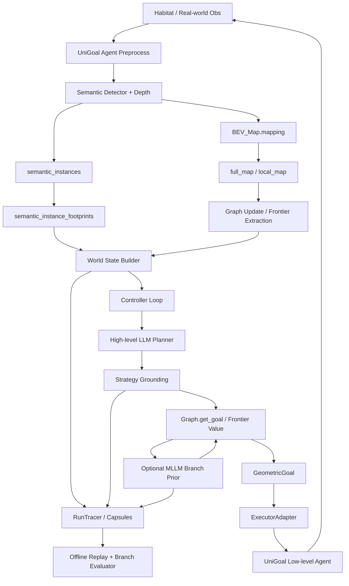
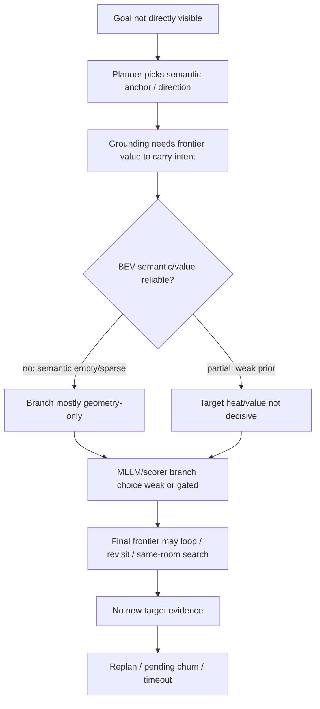

# SmoothNav Top-down Implementation Record

> 更新日期：2026-05-01  
> 关系说明：`docs/project_topdown_summary.md` 是压缩版系统总览；本文是另一份更细的实现记录，按 top-down 数据流解释每个模块“具体如何实现”，并更详细记录当前失败原因与下一步检查面。

---

## 1. 一句话系统定义

SmoothNav 是一个在 UniGoal 零样本导航基座上叠加的语义重规划系统。它把导航问题拆成三层：

1. **感知-建图层**：从 RGB-D 和语义检测结果维护 BEV occupancy/semantic map 与 scene graph；
2. **语义-几何转换层**：由 LLM/MLLM 选择搜索目标、frontier branch 或对象/房间锚点，并把它们落到地图坐标；
3. **执行-监控层**：用 UniGoal/FMM 低层 executor 执行局部目标，同时保存可回放 trace/capsule 以定位失败环节。

用状态空间形式写，SmoothNav 在每一步维护：

$$
x_t = (M_t, G_t, W_t, B_t, S_t, U_t),
$$

其中：

- $M_t$：BEV map，包括 obstacle、explored/free、agent、trajectory、semantic channels；
- $G_t$：scene graph，包括 object nodes、room nodes、relations、frontiers；
- $W_t$：world state，是给控制器/planner 的压缩状态；
- $B_t$：task belief / mission state / explored regions；
- $S_t$：当前高层 strategy 或 stage goal；
- $U_t$：frontier/value/branch utility，用于把语义意图转成可执行目标。

---

## 2. End-to-end 实现链路

### 2.1 总体调用链

### 2.2 一步 online 推理中的关键变量

一次 online step 大致产生下面这些变量：

| 阶段 | 核心变量 | 作用 |
|---|---|---|
| 感知 | `obs`, `rgbd`, `infos` | 环境返回原始观测与 episode 信息 |
| 语义检测 | `sem_seg_pred`, `pred_box`, `last_semantic_instances` | 检测对象类别、bbox 和语义 mask seed |
| 建图 | `local_map`, `full_map`, `planner_pose_inputs` | 维护局部/全局 BEV 以及 local map 边界 |
| 图结构 | graph nodes / room nodes / frontiers | 将检测对象、房间假设和 frontier 组织成可搜索图 |
| 控制状态 | `ControllerState`, `MissionState`, `TaskBelief` | 保存当前策略、pending 策略、已搜索区域、卡住状态 |
| 高层策略 | `Strategy` | 由 planner 输出，包含 target region、bias position、reasoning |
| 几何落地 | `GroundingResult`, `GeometricGoal` | 把语义策略转为 full/local map 目标 |
| 执行输入 | `agent_input`, `ExecutorCommand` | 交给 UniGoal 低层 agent 执行动作 |
| 监控证据 | trace JSONL / capsule | 支持离线重放和错误定位 |

---

## 3. 模块实现细节

### 3.1 感知与 BEV 建图层

#### 3.1.1 输入通道约定

系统把每帧 RGB-D 观测转成 mapping tensor。核心语义约定是：

$$
o_t = [RGB_t, Depth_t, Sem_t^1, \ldots, Sem_t^K].
$$

BEV map 则固定使用：

$$
M_t = [O_t, E_t, A_t, V_t, S_t^1, \ldots, S_t^K],
$$

其中：

- $O_t$：obstacle / wall；
- $E_t$：explored / free；
- $A_t$：current agent；
- $V_t$：visited trajectory；
- $S_t^k$：第 $k$ 类语义投影。

这个约定非常关键，因为后续 dense semantic BEV、DecisionState 和 executor 都默认 `full_map[4:]` 是真实 semantic projection，而不是文本标签或 object center 的可视化结果。

#### 3.1.2 RGB-D 到 semantic instances

感知层先用语义检测器得到：

$$
y_t = \{(c_i, conf_i, bbox_i, maskseed_i)\}_{i=1}^{N_t}.
$$

实现上，检测 bbox 原本在 detector 输入尺度上；系统会把 bbox 缩放到 mapping frame，再记录：

- instance id；
- category index / category label；
- confidence；
- bbox in mapping frame；
- bbox 内 semantic channel seed pixel count；
- source frame shape。

这一步的目的不是直接生成 BEV object box，而是给 BEV 投影层一个可追溯的 per-instance seed。

#### 3.1.3 Semantic instance footprint 投影

为了接近 SemExp/PONI 风格 dense semantic BEV，系统新增了一个独立于 `full_map[4:]` 的 object footprint 路径：

$$
F_t^{obj} = \Pi_{3D}(bbox_i, maskseed_i, D_t, p_t).
$$

具体过程是：

1. 在 detector bbox 内取 semantic mask seed；
2. 如果 bbox 内语义 channel 为空，则用 detector bbox 作为低置信 seed；
3. 用 depth 反投影到 point cloud；
4. 通过 camera view transform 和 pose transform 放到 agent-centric map；
5. 使用 splat / voxel projection 聚合成 top-down instance projection；
6. 把 local footprint bbox 转成 full-map rc 坐标；
7. 保存 `footprint_rc_indices`、`bbox_rc`、`raw_surface_bbox_rc`、`footprint_seed_cell_count`、`footprint_pixel_count`、`footprint_source` 等字段。

这里有一个重要设计：object footprint **不直接写回** `full_map[4:]`。它作为额外证据进入 world state / capsule / dense renderer。这样可以避免把低置信 detector bbox 混成真实 semantic channel，同时保留成熟 BEV 需要的 object occupancy 轮廓。

#### 3.1.4 当前 BEV 建图的边界

当前 BEV semantic 有两条来源：

1. **true semantic channel**：来自 `full_map[4:]`，最可信，但旧实验中非常稀疏；
2. **semantic instance footprint**：来自 detector bbox + depth projection，是 dense semantic BEV 的关键补充，但旧 capsule 没保存该证据。

因此当前失败分析必须区分：

- semantic map 为空，是上游 `obs[:,4:]` / mapping projection 问题；
- object footprint 为空，是 instance projection 或 capsule 保存问题；
- renderer 没画出对象，是证据为空或被 footprint trust gate 拒绝，而不应靠标签伪造。

---

### 3.2 Scene graph 与 frontier 层

#### 3.2.1 图状态

系统将当前已观察世界抽象为：

$$
G_t=(\mathcal{V}_t^{obj}, \mathcal{V}_t^{room}, \mathcal{E}_t^{rel}, \mathcal{F}_t),
$$

其中：

- $\mathcal{V}_t^{obj}$：对象节点，包含 caption、center、room assignment、target relevance 等；
- $\mathcal{V}_t^{room}$：房间节点或 room hypothesis；
- $\mathcal{E}_t^{rel}$：对象之间、对象与房间之间的空间/语义关系；
- $\mathcal{F}_t$：frontier candidates。

图层的核心作用是把连续地图压缩成 planner 可读的候选集合。

#### 3.2.2 Frontier 提取与候选压缩

frontier 是 unknown 和 explored/free 的边界。系统会先得到 raw frontier，再过滤/采样成较小候选集合：

$$
\mathcal{F}_t = \{f_i=(r_i,c_i)\}_{i=1}^{n}.
$$

随后进一步把相邻候选聚成 branch：

$$
\mathcal{B}_t = \{b_j\}_{j=1}^{m}, \quad b_j \subset \mathcal{F}_t.
$$

每个 branch 保存：

- branch id；
- representative coord；
- candidate point count；
- canonical direction from agent；
- score terms aggregate；
- branch-level semantic hints；
- local index to branch id 映射。

这个 branch table 是 MLLM 和 evaluator 的主接口。branch 不是地图状态本体，而是从 geometry/value field 中抽出的候选接口。

---

### 3.3 SmoothNav 控制主循环

#### 3.3.1 初始化

online 主循环启动后会组装这些对象：

- BEV map；
- scene graph；
- Habitat envs；
- UniGoal agent；
- ExecutorAdapter；
- GeometricGrounder；
- MissionProgressManager；
- WorldStateBuilder；
- PendingProposalManager；
- BudgetGovernor；
- TerminalArbiter；
- TacticalArbiter；
- HighLevelPlanner；
- optional MLLM frontier planner；
- optional low-level monitor。

初始化后系统先 reset 环境，做一次 mapping，然后把中心点作为初始 local goal 送给 executor，使 agent 进入可执行循环。

#### 3.3.2 Profile 配置如何影响行为

profile 本质上是控制参数 $\theta$ 的集合：

$$
\theta=(policy_{replan}, monitor, prefetch, stuck, reuse, noop, interval, \ldots).
$$

目前代表性 profile：

| Profile | 行为含义 |
|---|---|
| `baseline-explore` | 直接使用 UniGoal baseline explore，不启用 SmoothNav semantic controller |
| `baseline-periodic` | SmoothNav 模式，但固定间隔重规划，不用 monitor/prefetch/stuck replan |
| `smoothnav-no-monitor` | event-driven + prefetch + stuck replan，但关闭 monitor |
| `smoothnav-full` | event-driven + LLM escalation monitor + prefetch + stuck replan |
| `smoothnav-rules-only` | 用 rule monitor 替代 LLM monitor |
| `smoothnav-no-prefetch` | 保留 monitor 和 stuck replan，但禁用 prefetch |

#### 3.3.3 每步控制逻辑

每一步 online loop 会执行：

1. 根据 local step 或 near-goal 判断是否移动 local map；
2. 更新 graph 的 full map/full pose；
3. 构建 graph delta：new object、new room、caption change、frontier reached、no progress、stuck；
4. 构建 world state；
5. 更新 task belief；
6. 更新 budget；
7. TacticalArbiter 判断是否要 replan / monitor / continue；
8. 如果需要 replan，调用 high-level planner；
9. 如果有 monitor，则 monitor 可能给出 adjust / prefetch / replan；
10. ground 当前 strategy；
11. 构建 executor command；
12. 低层 agent 执行动作；
13. 写 trace、summary、episode result。

这个流程可以写成：

$$
S_t =
\begin{cases}
\pi_{LLM}(q,G_t,R_t,c_t), & \Omega(B_t,e_t;\theta)=1,\\
S_{t-1}, & \text{otherwise}.
\end{cases}
$$

然后：

$$
g_t = \Gamma(S_t,M_t,G_t,\mathcal{F}_t), \quad a_t=\pi_{exec}(M_t,p_t,g_t).
$$

---

### 3.4 高层 LLM Planner

#### 3.4.1 Planner 输入

高层 planner 的输入不是原始图像，而是文本化的任务状态：

$$
input_{LLM}=(q, T(G_t), R_t, c_t, C_t),
$$

其中：

- $q$：目标描述；
- $T(G_t)$：scene graph 序列化文本，包含房间、对象、关系；
- $R_t$：already searched / explored regions；
- $c_t$：replanning reason；
- $C_t$：choices menu，包括 object、room、direction 候选。

当前 choices 设计有一个重要不变量：planner 如果选择 menu 中的有效项，后续 grounding 应该能解析出坐标。为此：

- object choice 只给已知 center 的对象；
- room choice 只给可由对象簇估计 centroid 的房间；
- direction choice 始终可通过 agent pose 和 frontier/fixed offset 解析。

#### 3.4.2 Planner 输出

输出是结构化 JSON：

$$
S_t=(type_t,id_t,reason_t).
$$

代码中落为 `Strategy`：

- `target_region`：例如 `object:chair`、`kitchen`、`unexplored east`；
- `bias_position`：full-map rc 坐标；
- `reasoning`：短解释；
- `explored_regions`：已搜索区域；
- `anchor_object`：当 strategy 是 target search anchor 时记录对象名。

#### 3.4.3 Fallback 与空响应处理

当前 planner 有几类防御逻辑：

1. LLM 返回空时，记录 `empty_response` 并重试；
2. 如果有可判定的 stuck object fallback 或 semantic direction fallback，则先用 heuristic；
3. 如果 fallback 只产生 generic direction，不应替换更具体的当前 strategy；
4. 如果 fallback 产生 target-aware/object strategy，可以替换当前 strategy。

这解释了为什么 “API 空响应” 不是单点问题：如果 fallback 退化成方向探索，会减少语义决策质量；如果 fallback 能稳定产出 target-aware anchor，则系统仍能维持部分语义搜索。

---

### 3.5 Strategy grounding 与 frontier value

#### 3.5.1 Strategy 到几何目标

grounding 输入为：

$$
(S_t, M_t, G_t, \mathcal{F}_t, p_t).
$$

输出为：

$$
GroundingResult=(success, selected\_frontier, projected\_goal, reason, debug).
$$

系统优先检查 direct object goal：如果 planner 选择了对象，并且对象 center 可以投影到当前 local planning window，同时 target relevance 足够高，则允许直接执行对象目标。否则该对象只作为 semantic anchor，不能直接让 executor 去追一个不可达/不确定点。

#### 3.5.2 Text-goal 下 object anchor 的特殊逻辑

对于 text goal，系统默认更谨慎：

- 非 local 的 target object 不能直接作为 executor goal；
- 它会作为 frontier selection 的 bias；
- 如果对象 relevance 低于阈值，则连 bias 也会被阻止；
- 这样避免把 “上下文对象” 误当成最终目标。

这个设计能防止错误目标锁定，但也带来一个问题：当目标不可见时，系统非常依赖 frontier/value 是否能正确承接这个 semantic anchor。

#### 3.5.3 Frontier value 评分

frontier 最终分数可写成：

$$
score(f)=base(f)
+ w_s bias(f)
+ w_t progress(f)
+ w_p prior(f)
+ w_n novelty(f)
+ w_a actionability(f)
- w_r repeat(f)
- w_c recent(f).
$$

各项含义：

- `base`：传统 frontier/value 基础项；
- `bias`：靠近 planner bias/object anchor 的程度；
- `progress`：target anchor 下，是否更接近 target hypothesis；
- `prior`：MLLM branch prior；
- `novelty`：frontier 附近 unknown density；
- `actionability`：是否在 local window 内可执行；
- `repeat/recent`：是否重复访问同一个 frontier。

最终选：

$$
f^*=\arg\max_f score(f).
$$

#### 3.5.4 Target progress 是 PONI-lite 的第一步

target progress 的设计目的是解决短程 semantic bias 容易归零的问题。它不训练网络，而是用可解释距离函数构造：

$$
progress(f)=\max\left(
\frac{d(p_t,target)-d(f,target)}{scale},
\frac{1}{1+d(f,target)/scale}
\right).
$$

如果 FMM distance 异常大或不可达，则回退到 Euclidean distance。它解决的是 “目标 anchor 不在当前 connected explored map 中时，所有 frontier bias 变成 0” 的问题。

#### 3.5.5 MLLM frontier prior 的 gate

MLLM frontier planner 采用 two-pass grounding：

1. **dry pass**：不写 selection history，只生成 deterministic frontier branches 和 BEV image；
2. **MLLM pass**：给 MLLM branch table + BEV，得到 selected branch / ranking / evidence level；
3. **final pass**：如果 evidence level 足够，临时注入 branch prior，再重新 `Graph.get_goal`。

关键 gate：

| Evidence level | prior gate strength |
|---|---:|
| direct | 1.0 |
| anchor | 0.85 |
| room_prior | 0.55 |
| geometry_only | 0.0 |

这意味着 geometry-only 的 MLLM 选择不会强行改变 frontier scorer。这个 gate 是后来针对 “无语义证据时 MLLM 硬选 branch” 的问题加入的保护。

---

### 3.6 MLLM Frontier Planner 与 BEV DecisionState

#### 3.6.1 为什么需要 DecisionState

早期 planner BEV 图更像 debug overlay：灰色 occupancy map 上叠加 B#/O#/R# label、score、warning 和 side panel。成熟工作如 SemExp/PONI 更接近：

$$
D_t=(X^{geo},X^{sem},V^{target},Table^{branch}).
$$

即 planner 看到的是“决策状态场”，不是“人类调试截图”。因此当前实现开始把 BEV 输入拆成：

1. geometry field；
2. semantic field；
3. target value field；
4. branch candidate decision table；
5. evidence level contract；
6. canonical coordinate contract。

#### 3.6.2 Geometry field

Geometry field 从 full map 中抽取：

- obstacle；
- free；
- explored；
- unknown；
- visited；
- frontier mask。

frontier mask 不是 branch label，而是在 branch candidate coord 周围画小半径 field，表示候选接口的位置。

#### 3.6.3 Semantic field

Semantic field 有三类来源：

1. **true semantic channel**：`full_map[4:] > threshold`，作为真实 dense semantic evidence；
2. **object support**：如果 object 有 projected footprint，则使用 footprint；否则只能使用低置信 object center prior；
3. **localized room/function-area**：只有 room 有 center、bbox、mask、对象簇或 entry region 才能空间化。

未定位 room hypothesis 必须进入 `unlocalized_room_hypotheses`，不能画成 R# box，也不能作为强空间证据。

#### 3.6.4 Target-conditioned value field

DecisionState 中的 target value 由多个 component 组成：

$$
V = norm(
1.00V_{direct}
+0.74V_{anchor}
+0.55V_{room}
+0.36V_{geometry}
-0.28P_{revisit}
-0.18P_{deadend}
).
$$

component 含义：

- `direct_target_value`：目标类别或目标对象已经被直接定位；
- `anchor_value`：目标不可见，但存在强相关 anchor object；
- `room_prior_value`：目标相关 room/function area 已经空间化；
- `geometry_fallback_value`：无语义时基于 info gain/actionability/revisit/deadend；
- `revisit/deadend penalty`：惩罚循环和死胡同。

branch table 对每个 branch 聚合：

- `target_value_mean/max`；
- `direct_value`；
- `anchor_value`；
- `room_prior_value`；
- `geometry_value`；
- `info_gain`；
- `revisit_penalty`；
- `dead_end_risk`；
- `semantic_support`；
- `evidence_level`；
- `risk_flags`。

证据等级规则：

| 条件 | evidence_level |
|---|---|
| direct max >= 0.25 | direct |
| anchor max >= 0.20 | anchor |
| room max >= 0.20 | room_prior |
| 否则 | geometry_only |

#### 3.6.5 Canonical coordinate contract

DecisionState 对 planner 暴露单一坐标系：

- coordinate type：full-map row/col；
- row axis：image y / south-down；
- col axis：image x / east-right；
- north arrow：image up；
- agent rc：来自 canonical agent display coord。

旧 raw/local/repaired 坐标只保存在 debug 字段，不进入 branch table 的 planner-critical 部分。这个修正是为了避免 MLLM 同时接收多个互相冲突的坐标定义。

---

### 3.7 Dense Semantic BEV Renderer

#### 3.7.1 Dense raster 的目标

Dense semantic renderer 的目标不是美化图像，而是生成一个 top-down class grid：

$$
R_t \in \mathbb{Z}^{H\times W}.
$$

每个 cell 只能属于一种主体类别：unknown、free、obstacle 或 semantic category。agent/trajectory/frontier 只作为很薄的 overlay，不改变主体 class map。

#### 3.7.2 真实 semantic channel 的处理

如果 `full_map[4:]` 有 channel 高于阈值，则：

1. 对每个 cell 取 semantic max；
2. 对超过阈值的 cell 写入类别 class id；
3. 统计 per-category pixel count；
4. 计算 semantic coverage ratio；
5. 输出 `semantic_source=map_channels`。

如果没有 active semantic channel，则必须输出：

- `semantic_source=empty_map_channels`；
- `semantic_coverage_ratio=0.0`；
- warning: `semantic_channels_empty`；
- warning: `dense_semantic_bev_cannot_show_object_regions_without_semantic_projection`。

#### 3.7.3 Object footprint 的 trust gate

object footprint 只有在有可信 3D/top-down 来源时才能画入 dense map。可信来源包括例如：

- projected point-cloud bbox cells；
- semantic instance depth bbox cells；
- graph 3D bbox cells；
- graph object bbox with 3D provenance。

如果只有 object center 或无来源 bbox，renderer 会拒绝，并记录 rejected reason。这样做是为了避免“用一个标签中心点画大圆/大框冒充 mature dense BEV”。

#### 3.7.4 为什么旧 capsule 仍然稀疏

s36 replay 中：

| Step | semantic source | active cats | true sem px | object footprint px |
|---:|---|---:|---:|---:|
| 31 | empty_map_channels | 0 | 0 | 0 |
| 43 | empty_map_channels | 0 | 0 | 0 |
| 98 | map_channels | 1 | 23 | 0 |
| 145 | map_channels | 3 | 50 | 0 |

这说明旧 capsule 没有保存 projected instance footprints。当前 renderer 的“看起来仍稀疏”不一定是 renderer 失败，而是输入证据确实缺失。下一步必须用新 online probe 产生新的 capsule，而不能只用旧 artifact 判断新 projection path。

---

### 3.8 Trace、Capsule 与离线 replay

#### 3.8.1 Trace 写入

RunTracer 会把不同粒度的证据写成 JSONL：

- step traces；
- planner calls；
- monitor calls；
- grounding snapshots；
- MLLM frontier calls；
- task frame capsules。

这些 trace 让我们可以从最终失败回到某个 step 的具体 planner/grounding/branch 状态。

#### 3.8.2 Task frame capsule

Capsule 保存某个关键 step 的局部充分统计量：

- manifest；
- world state；
- graph snapshot；
- raw frontier；
- frontier branches；
- planner prompt/response/parsed verdict；
- scoring input/replay；
- grounding result；
- executor followup；
- maps.npz；
- semantic BEV frame；
- semantic projection summary；
- semantic instance footprints；
- object footprints。

这个设计的目标是做到：不启动 Habitat、不调用 LLM，也能重建该 step 的 BEV/DecisionState/branch decision。

#### 3.8.3 Replay 输出

Replay 会输出：

- `semantic_bev_frame.json`；
- `planner_decision_state.json`；
- `planner_decision_state_fields.npz`；
- `dense_semantic_bev.png/json`；
- `semantic_footprint_bev.png/json`；
- `debug_overlay_full.png`；
- `semantic_annotated_bev_planner.png`；
- `decision_state_bev_planner.png`；
- `semantic_field_panel.png`；
- `target_value_field_panel.png`；
- `review_result.json`；
- replay summary。

#### 3.8.4 Branch decision evaluator

Evaluator 检查 branch 选择是否由合法证据支持。典型 issue code：

| Issue | 含义 |
|---|---|
| `no_active_semantic_channels` | 当前 BEV 无 dense semantic evidence |
| `direct_target_channel_empty` | 目标没有直接可见，不能作为 direct grounding |
| `no_target_heatmap` | 没有空间 target/query heat 支撑 branch preference |
| `target_heatmap_prior_only` | 只有 prior，不是目标定位 |
| `geometry_only_branch_hard_gated` | geometry-only 分支被当作强 planner prior 使用 |
| `final_branch_not_top_heatmap_branch` | final branch 与 heatmap top branch 不一致 |
| `final_branch_not_top_target_value_branch` | final branch 与 target value top branch 不一致 |
| `agent_display_repaired` | raw agent coord 与 map-current coord 冲突，显示被修正 |

---

## 4. 当前代表性实验记录

### 4.1 s6 mini-matrix

**Observation**：s6 对 228/527/661 三个 episode 比较了 baseline-periodic、smoothnav-no-monitor、smoothnav-full。

| Profile | SR | SPL | 终局 |
|---|---:|---:|---|
| baseline-periodic | 0.3333 | 0.1006 | 228/527 失败，661 成功 |
| smoothnav-no-monitor | 0.3333 | 0.2843 | 228/527 失败，661 成功 |
| smoothnav-full | 0.3333 | 0.2843 | 228/527 失败，661 成功 |

**Claim（matched mini-matrix 内成立）**：SmoothNav event-driven profile 在成功样本上改善 SPL，但没有提升 SR；monitor 在这轮没有独立可见增益。

### 4.2 ep228 单场景 probe

**Observation**：ep228 多轮单场景 probe 仍失败：

| 轮次 | SR | SPL | 关键信号 |
|---|---:|---:|---|
| s12 target anchor | 0 | 0 | high-level calls 18，pending created 11/promoted 10 |
| s15 online probe | 0 | 0 | high-level calls 12，pending created 7/promoted 6 |
| s19 sonnet4.5 | 0 | 0 | high-level calls 20，out_of_local_window 8 |
| s22b BEV/MLLM union | 0 | 0 | high-level calls 7，保存 capsule 后仍 timeout |

**Interpretation**：这不是单纯 API/model 不够强；失败集中在目标不可见时，semantic anchor、frontier value、BEV 输入和 grounding 承接链条不稳定。

### 4.3 s26/s36 BEV replay

**Observation**：s26 branch evaluator 对关键 step 的问题定位为：

- step31：agent coord repair、semantic empty、direct target empty、no heatmap；
- step43：同上，并出现 geometry-only branch hard-gated；
- step98：direct target empty、no heatmap、geometry-only branch hard-gated；
- step145：target heatmap prior only，final/MLLM branch 不等于 top heatmap branch，final branch 不等于 top target-value branch。

**Observation**：s36 修正后旧 capsule 的 semantic evidence 仍稀疏：31/43 为空，98 只有 23 个 true semantic pixels，145 只有 50 个 true semantic pixels，object footprint 为 0。

---

## 5. 当前失败原因：细粒度拆解

### 5.1 失败主链路

当前 ep228 类 hard case 的主失败链可以写成：

核心不是某一个函数返回错，而是多层证据都弱：目标不可见、semantic BEV 稀疏、object footprint 缺失、room prior 未空间化、branch value 与 final decision 不闭环。

### 5.2 卡点一：Semantic channel 为空或极稀疏

成熟工作中的 semantic BEV 依赖持续语义投影；当前旧 capsule 显示：

- step31/43：semantic channels empty；
- step98/145：虽然有 semantic channel，但像素数量非常少；
- object footprint 没有被保存进旧 capsule。

这会导致 MLLM 看到的图仍像 occupancy map，而不是 semantic decision state。即使 prompt 写得更好，模型也缺少空间语义证据。

### 5.3 卡点二：Object footprint 的上游证据还没有在线闭环验证

当前代码已经有 detector bbox + depth projection 到 BEV footprint 的路径，但旧实验没有记录足够 artifact。因此必须确认：

1. `last_semantic_instances` 是否每步非空；
2. BEV_Map 是否生成 `last_semantic_instance_footprints`；
3. world state 是否带出 `semantic_instance_footprints`；
4. capsule 是否写出 `semantic_instance_footprints.json`；
5. dense renderer 是否接受这些 footprint，而不是因 trust gate 拒绝；
6. footprint 的 bbox/rc_indices 是否与实际对象位置和大小一致。

如果这些没有闭环，BEV 永远只能显示稀疏 semantic pixels。

### 5.4 卡点三：Planner 仍主要依赖文本 scene graph

高层 planner 目前的主要输入仍是 scene graph 文本和 choices menu。它能做 commonsense reasoning，但不能直接知道空间布局细节。BEV/MLLM frontier planner 的加入是为了补上空间选择，但只有在 DecisionState 可靠时才有效。

因此当前系统存在两级 planner mismatch：

- 高层 LLM 负责语义 intent，但空间信息弱；
- MLLM frontier 负责空间 branch，但 semantic BEV 弱。

两者之间如果没有统一的 target value field 和 branch evidence contract，就会出现“语义上合理、几何上循环”或“几何上可走、语义上无收益”的选择。

### 5.5 卡点四：Target value 与 final branch 不完全一致

Evaluator 已经发现 step145 中 final branch 与 top target-value branch 不一致。可能来源包括：

- MLLM prior 被 evidence gate 降权后，Graph.get_goal 仍由原 scorer 决定；
- target value field 和 frontier scorer 使用的 component/weights 不完全一致；
- branch table 聚合的是 branch-level value，但最终选择仍发生在 frontier point level；
- branch representative coord 与实际 selected frontier point 不完全一致；
- repeat/recent penalty 与 semantic/anchor value 的组合顺序导致排名变化。

这说明后续不能只看 MLLM 输出，需要同时保存：dry branch、MLLM branch、final branch、frontier point score breakdown、branch table rank。

### 5.6 卡点五：Grounding / local window / executor 仍可能断链

历史结果中出现过 `out_of_local_window`，说明语义目标或 selected frontier 即使在 full map 上合理，也可能无法投影到当前 local planning window。当前代码增加了 local actionability score 和 fallback，但仍需要确认：

- selected frontier 是否 local projectable；
- if not，是否被 actionability filter 排除或 fallback；
- executor command 是否真的采用了新 goal；
- goal_update_delay 是否过大；
- repeated same_goal/same_frontier 是否导致局部循环。

### 5.7 卡点六：Monitor 不是当前瓶颈

s6 中 `smoothnav-full` 与 `smoothnav-no-monitor` SR/SPL 完全相同。说明当前 monitor 还没有带来独立收益。更可能的优先瓶颈是：

1. target anchoring；
2. BEV semantic/state 表示；
3. branch value / grounding；
4. replayable diagnostics。

### 5.8 卡点七：Cross-scene validation 被数据资产阻塞

项目约束中已经明确 HM3D val 资产损坏阻塞 cross-scene validation。该问题应作为 dataset blocker，而不是 controller failure。任何论文级 claim 都不能在这个 blocker 未解除前宣称完整 multi-scene generalization。

---

## 6. 下一轮最小验证应该如何展开

### 6.1 不建议直接完整重跑大 suite

当前失败不是最终成功率统计不够，而是中间证据链没有闭环。因此完整 online episode 容易重复消耗时间，却不能告诉我们是哪一层错了。

### 6.2 推荐的最小 online probe

只运行一个已知失败场景，并打开完整 capsule/BEV/trace 记录。每个关键 step 检查：

1. detector instances count；
2. semantic channel active count；
3. semantic instance footprint count；
4. dense BEV object footprint pixel count；
5. rejected footprint reason；
6. branch evidence distribution；
7. dry / MLLM / final branch；
8. final frontier point score breakdown；
9. local projection status；
10. executor adoption status。

### 6.3 推荐的分阶段 gate

| Gate | 通过标准 | 若失败，定位到 |
|---|---|---|
| G1 detector | 有合理 object bbox / category | detector 或 semantic segmentation |
| G2 projection | 有 semantic_instance_footprints | depth projection / pose transform |
| G3 renderer | dense BEV 出现可信 object occupancy | renderer trust gate / footprint source |
| G4 decision state | branch evidence 非全 geometry-only | semantic/value field |
| G5 branch consistency | final branch 与 target-value top branch 一致或有解释 | scorer / MLLM prior / branch aggregation |
| G6 executor | selected frontier local projectable 且 executor 接收 | grounding / local window / executor adapter |

---

## 7. 需要继续确认的问题清单

1. 新 online capsule 是否能保存 projected object footprints；
2. footprint bbox 是否贴合对象真实 top-down 位置，而不是墙边滑移或过度膨胀；
3. true semantic channel 稀疏是否来自 segmentation、projection、threshold，还是历史 artifact 缺失；
4. branch table rank 和 Graph.get_goal final rank 是否能统一；
5. MLLM planner 在 geometry-only 时是否完全不施加强 prior；
6. target anchor 的 stall/decommit 是否过早或过晚；
7. local actionability filter 是否有时把语义上最优 frontier 排除；
8. monitor 是否还有必要继续优化，或暂时冻结；
9. HM3D val 资产修复后，哪些 episodes 应作为最小 cross-scene suite。

---

## 8. 当前最重要的工程原则

1. **不要伪造语义**：semantic channel 为空时必须报告为空；object center 不能冒充 dense semantic mask。
2. **先证据链闭环，再跑完整 episode**：必须先证明 detector→projection→capsule→dense BEV→decision state 是通的。
3. **branch 是候选接口，不是状态本体**：先构造 geometry/semantic/value field，再评估 branch。
4. **所有 planner-critical 坐标只用 canonical full-map rc**：raw/local/repaired 坐标留在 debug。
5. **每个失败都要落到具体层**：semantic projection、value field、branch gate、grounding、executor，不能只写 timeout。

---

## 9. 一句话结论

SmoothNav 的控制框架和可回放诊断体系已经基本建立；当前核心问题是 target 不可见时，系统还没有稳定地产生成熟工作风格的 dense semantic decision-state BEV，导致 semantic anchor 无法可靠传递到 frontier value 与最终 executor goal。下一轮工作应优先验证并修复 detector/semantic-instance footprint 到 dense BEV/DecisionState 的证据链，而不是继续扩大完整 episode 重跑。
