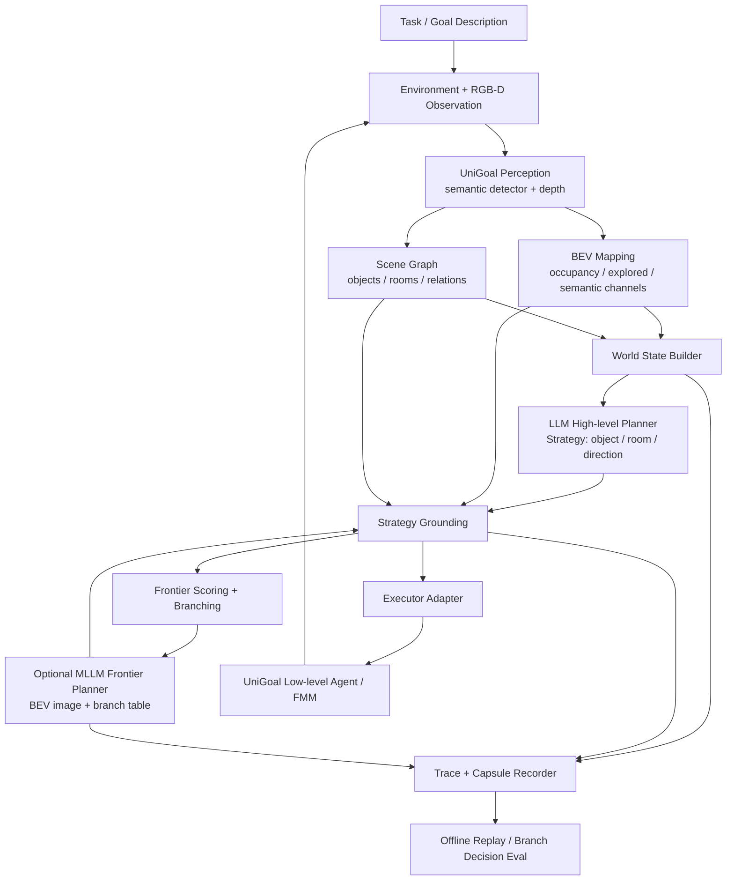
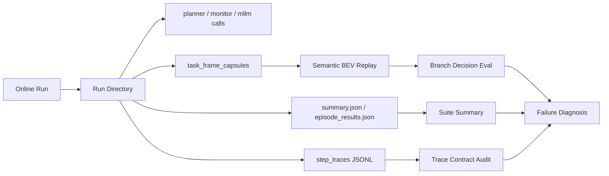
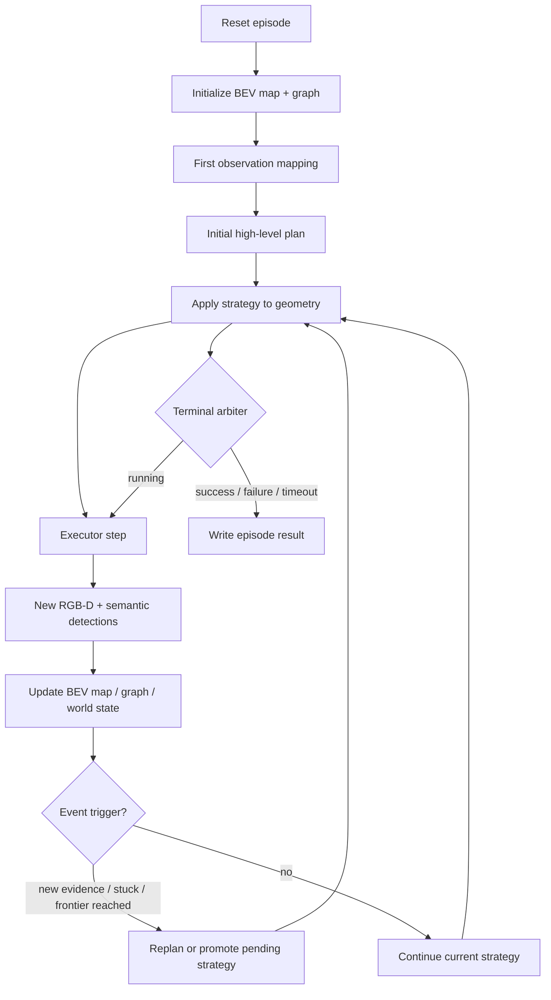
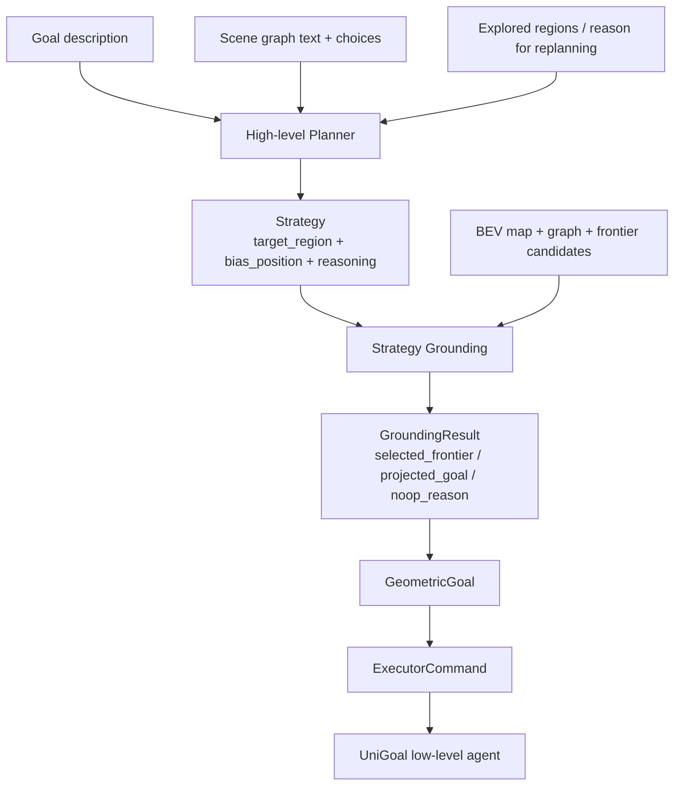
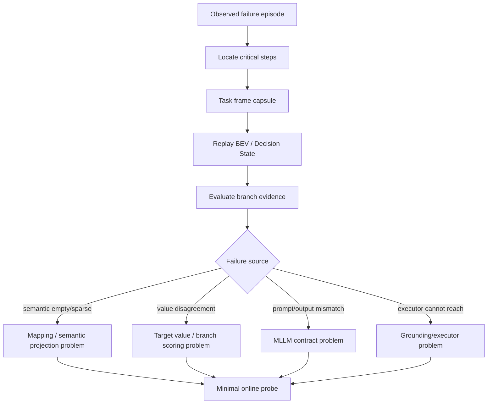

# SmoothNav 项目 Top-down 梳理

> 更新日期：2026-04-30  
> 目的：给后续讨论、实验审查和论文定位提供一份从系统目标到关键卡点的总览。本文不是逐文件说明，而是按系统层级、数据流、实验证据和下一步决策组织。

## 1. 一句话概括

SmoothNav 是一个基于 UniGoal 的 **map-grounded semantic replanning** 导航系统：底层保留 UniGoal 的 BEV 建图、场景图和低层执行器，上层新增 LLM/MLLM 语义规划、事件驱动重规划、目标锚定、frontier 评分与可回放监控，用于在未知室内环境中更稳定地完成文本/对象目标导航。

---

## 2. Top-down 总体结构

从系统责任划分看，SmoothNav 可以分成五层：

1. **环境与感知层**：Habitat/真实环境输入 RGB-D；UniGoal agent 做语义检测、深度预处理和低层动作接口。
2. **地图与图结构层**：维护 occupancy/semantic BEV、agent pose、visited trajectory、frontier、scene graph/object graph。
3. **语义决策层**：LLM 高层 planner 将任务、场景图、已搜索区域转成 `Strategy`；MLLM frontier planner 在 BEV/branch 候选上做局部选择。
4. **几何落地与执行层**：将语义目标落到 full/local map frontier 或对象坐标，再交给 UniGoal/FMM 风格 executor。
5. **实验监控与回放层**：记录 step trace、planner call、grounding snapshot、task frame capsule；用离线 replay/evaluator 复盘具体失败环节。



---

## 3. 核心模块：数学建模视角

本节不按代码路径罗列实现，而是把 SmoothNav 抽象为一个部分可观测导航过程。令第 $t$ 步观测为

$$
o_t=(I_t, D_t, y_t),
$$

其中 $I_t$ 是 RGB 图像，$D_t$ 是深度，$y_t$ 是语义检测/分割结果；机器人位姿为 $p_t$，目标文本为 $q$。系统维护的核心状态可写成

$$
x_t = (M_t, G_t, B_t, h_t),
$$

其中 $M_t$ 是 BEV 地图，$G_t$ 是对象-房间-关系图，$B_t$ 是任务信念与已搜索区域，$h_t$ 是历史轨迹、planner 调用和 grounding 记录。

### 3.1 UniGoal 基座：从观测到地图、图和低层动作

UniGoal 基座可以建模为一个状态估计器加低层控制器。给定上一时刻地图 $M_{t-1}$、当前观测 $o_t$ 和位姿 $p_t$，BEV 建图模块更新

$$
M_t = \Phi_{map}(M_{t-1}, o_t, p_t).
$$

这里的 $M_t$ 至少包含 obstacle、explored/free、agent、visited trajectory 和 semantic channels：

$$
M_t = [O_t, E_t, A_t, V_t, S_t^1, \ldots, S_t^K].
$$

其中 $O_t$ 表示障碍，$E_t$ 表示已探索可通行区域，$S_t^k$ 表示第 $k$ 类语义在 BEV 栅格上的投影。scene graph 可抽象为

$$
G_t = (\mathcal{V}_t^{obj}, \mathcal{V}_t^{room}, \mathcal{E}_t^{rel}),
$$

并由观测和地图增量更新：

$$
G_t = \Phi_{graph}(G_{t-1}, o_t, M_t).
$$

低层执行器接收局部目标 $g_t$，输出动作

$$
a_t = \pi_{exec}(M_t, p_t, g_t),
$$

其职责不是重新理解任务，而是在已有地图上朝给定几何目标移动。

### 3.2 SmoothNav 控制主循环：事件驱动的语义重规划

SmoothNav 在 UniGoal 闭环外加入一个高层控制策略。它首先把地图、图、历史和 executor 反馈压缩为任务信念

$$
B_t = \Psi(M_t, G_t, h_t, e_t),
$$

其中 $e_t$ 表示运行事件，例如 new object、new room、frontier reached、stuck、grounding failure 或 no progress。控制器根据 profile 参数 $\theta$ 判断是否触发重规划：

$$
\tau_t = \Omega(B_t, e_t; \theta) \in \{0,1\}.
$$

若 $\tau_t=0$，系统继续执行当前几何目标；若 $\tau_t=1$，系统进入语义 planner / grounding 流程。不同 profile 的差别可以视为不同的 $\theta$：例如 fixed interval、event-driven、monitor on/off、stuck suppression、pending promotion 等。

### 3.3 语义 planner 与 grounding：从语言目标到可执行几何目标

高层 planner 的目标是从文本目标 $q$、当前图状态 $G_t$、已搜索集合 $R_t$ 和重规划原因 $c_t$ 中生成语义策略

$$
s_t = \pi_{LLM}(q, G_t, R_t, c_t).
$$

策略可写成结构化变量

$$
s_t = (\kappa_t, i_t, r_t),
$$

其中 $\kappa_t \in \{object, room, direction\}$ 表示选择类型，$i_t$ 是对象、房间或方向标识，$r_t$ 是自然语言理由。grounding 层随后把语义策略投影到地图空间：

$$
g_t = \Gamma(s_t, M_t, G_t, \mathcal{F}_t),
$$

其中 $\mathcal{F}_t$ 是 frontier 候选集合。若策略指向已定位对象，$\Gamma$ 倾向于对象中心或可观测邻域；若策略指向房间，$\Gamma$ 使用房间内对象簇或房间几何中心；若策略指向方向，$\Gamma$ 从 frontier 中选择与方向和可达性一致的候选。frontier 评分可抽象为

$$
score(f) = w_b \phi_{bias}(f,s_t) + w_n \phi_{novelty}(f) + w_a \phi_{action}(f) - w_r \phi_{repeat}(f),
$$

最终选择

$$
f_t^* = \arg\max_{f\in\mathcal{F}_t} score(f).
$$

### 3.4 MLLM frontier planner 与 BEV decision state：从调试图到决策状态

MLLM frontier planner 的输入不应只是带标签的 debug overlay，而应是结构化决策状态

$$
D_t = (X_t^{geo}, X_t^{sem}, V_t^{target}, \mathcal{B}_t).
$$

其中 $X_t^{geo}$ 是几何场，包含 obstacle/free/explored/unknown/visited/frontier；$X_t^{sem}$ 是语义场，包含真实 semantic channel、可定位 object footprint 和已空间化 room/function-area；$V_t^{target}$ 是 target-conditioned value field；$\mathcal{B}_t$ 是 branch candidate table。

目标价值场的 deterministic PONI-lite / VLFM-lite 形式可写成

$$
V_t^{target}=\operatorname{norm}(
w_d V_t^{direct} +
w_a V_t^{anchor} +
w_r V_t^{room} +
w_i V_t^{info} +
w_u V_t^{unexplored}
- w_v P_t^{revisit} -
w_e P_t^{deadend}
).
$$

每个 branch $b\in\mathcal{B}_t$ 聚合局部价值和风险：

$$
U(b)=\alpha \operatorname{mean}_{x\in b} V_t^{target}(x)
+ \beta \max_{x\in b} V_t^{target}(x)
+ \gamma I(b)
- \lambda R(b).
$$

MLLM 或 deterministic scorer 的输出应是

$$
b_t^* = \arg\max_{b\in\mathcal{B}_t} U(b),
$$

并同时给出 evidence level：direct、anchor、room_prior 或 geometry_only。这个证据等级很重要：当语义为空时，系统可以继续探索，但不能把 geometry-only branch 伪装成目标已被语义支持。

### 3.5 实验、监控与离线复盘：把失败变成可定位变量

实验系统的核心不是只记录最终 SR/SPL，而是保存可复现的中间变量序列。一次 episode 的 trace 可抽象为

$$
\mathcal{T}=\{(o_t, M_t, G_t, B_t, s_t, g_t, b_t^*, a_t, e_t)\}_{t=1}^{T}.
$$

当某一步失败或决策可疑时，capsule 保存该步的局部充分统计量

$$
C_t = \operatorname{capsule}(M_t, G_t, D_t, \mathcal{F}_t, s_t, g_t, b_t^*).
$$

离线 replay 是一个近似重建算子

$$
\hat{D}_t = \mathcal{R}(C_t),
$$

branch evaluator 则检查最终选择是否受到足够证据支撑：

$$
\mathcal{I}_t = \mathcal{E}(\hat{D}_t, b_t^*),
$$

其中 $\mathcal{I}_t$ 是问题集合，例如 semantic channels empty、direct target channel empty、geometry-only hard gate、final branch not top target-value branch 等。这样，失败不再只表现为 episode timeout，而能被拆解到 semantic projection、target value、branch gate、grounding 或 executor 中的具体环节。

---

## 4. 主要训练、推理和评估入口

### 4.1 训练入口

**Observation**：当前 SmoothNav 主线没有明确的训练流程；它更像一个 zero-shot / inference-time replanning 系统。配置中保留 PPO/RL 风格字段（如 lr、ppo_epoch、reward_coeff），但目前我看到的 SmoothNav 入口主要是 evaluation/inference 和 replay，而不是训练。

**需要确认**：这些训练相关配置是否只是 UniGoal legacy 参数，还是远端存在未纳入当前仓库的训练脚本。

### 4.2 Online 推理 / 实验入口

- UniGoal 原始入口：
  - `python base_UniGoal/main.py --goal_type text`
  - `python base_UniGoal/main.py --goal_type ins-image`
- SmoothNav 入口：
  - `python -m smoothnav.main --goal_type text --controller-profile <profile>`
  - 关键 profile：`baseline-explore`、`baseline-periodic`、`smoothnav-no-monitor`、`smoothnav-full`。
- 运行时输出：
  - `summary.json`
  - `episode_results.json`
  - `manifest.json`
  - `effective_config.json`
  - `step_traces/`
  - `planner_calls/`
  - `monitor_calls/`
  - `grounding_snapshots/`
  - `task_frame_capsules/`

### 4.3 Offline replay / 评估入口

- suite 聚合：`scripts/summarize_explicit_suite.py`
- BEV/capsule replay：`scripts/replay_semantic_bev_capsules.py`
- branch decision evaluator：`scripts/evaluate_semantic_bev_branch_decisions.py`
- grounding replay：`scripts/replay_grounding_snapshot.py`
- trace contract audit：`scripts/audit_trace_contracts.py`



---

## 5. 关键流程图

### 5.1 Online 控制闭环



### 5.2 Planner 到 executor 的分层契约



### 5.3 BEV / MLLM frontier decision-state 构造

```mermaid
flowchart TD
    A[full_map / local_map] --> B[Geometry Field\nobstacle/free/explored/unknown/visited/frontier]
    A --> C[True Semantic Channels\nfull_map[4:]]
    D[Graph objects + semantic instances] --> E[Localized Object Footprints / Support]
    D --> F[Room hypotheses]
    C --> G[Semantic Field]
    E --> G
    F --> G
    H[Target description + strategy] --> I[Target-conditioned Value Field]
    G --> I
    B --> I
    J[Frontier branches] --> K[Branch Candidate Table]
    I --> K
    B --> L[Planner BEV image]
    G --> L
    I --> L
    K --> L
    L --> M[MLLM Frontier Planner]
    K --> M
    M --> N[Branch choice + rationale + evidence level]
```

### 5.4 失败复盘链路



---

## 6. 代表性实验与当前证据

### 6.1 s6 matched mini-matrix：profile 级别对照

**Observation**：`s6_cross_scene_minimatrix_20260423` 对 episodes 228/527/661 做了三组 profile 对照：

| Profile | SR | SPL | 终局概况 |
|---|---:|---:|---|
| baseline-periodic | 0.3333 | 0.1006 | ep228/527 fail，ep661 success |
| smoothnav-no-monitor | 0.3333 | 0.2843 | ep228/527 fail，ep661 success |
| smoothnav-full | 0.3333 | 0.2843 | ep228/527 fail，ep661 success |

**Claim（小样本、matched control）**：在这组三 episode mini-matrix 中，SmoothNav event-driven 系列相对 periodic baseline 提高了 SPL，但没有提高 SR；`smoothnav-full` 与 `smoothnav-no-monitor` 完全并列，monitor 在这轮没有独立可见增益。

**Interpretation**：ep228/527 更像共同 hard cases，不是 `smoothnav-full` 独有故障；ep661 是正向 anchor，说明事件驱动在成功 episode 上能减少路径浪费。

### 6.2 ep228 单 episode 修复轮次

**Observation**：多个 ep228 单场景实验仍以失败结束：

| 轮次 | Profile | SR | SPL | 代表性现象 |
|---|---|---:|---:|---|
| s12 temperature0 target anchor | smoothnav-full | 0.0 | 0.0 | high-level calls 18，pending 创建/提升较多，仍 timeout |
| s15 target anchor attempt online probe | smoothnav-full | 0.0 | 0.0 | high-level calls 12，pending 仍无法解决目标锚定 |
| s19 sonnet4.5 ep228 | smoothnav-full | 0.0 | 0.0 | out_of_local_window 仍出现 |
| s22b BEV/MLLM union ep228 | smoothnav-full | 0.0 | 0.0 | 引入 BEV/MLLM 监控后仍 timeout |

**Observation**：这些是单 episode probe，不能作为总体性能 claim；它们的价值主要是暴露“目标不可见时，planner/frontier/grounding 如何联动失败”。

### 6.3 BEV / capsule replay 证据

**Observation**：针对 s22b 保存的 capsule，后续离线 replay 重点审查 step 31/43/98/145。

- s27 dense semantic replay：
  - step31/43：`semantic_source=empty_map_channels`，`true_semantic_pixel_count=0`。
  - step98：`semantic_source=map_channels`，active channel 1，true semantic pixels 23。
  - step145：active channel 3，true semantic pixels 50。
- s24/s25/s26 branch evaluator：
  - 多个关键 step 存在 `direct_target_channel_empty`，说明不能把目标当作已可见。
  - step43/98 出现 `geometry_only_branch_hard_gated`，说明 branch 选择可能过度使用 planner prior。
  - step145 出现 final branch 与 top heatmap/target-value branch 不一致，说明 value field 与最终 branch 选择仍未完全对齐。
- s36 BEV correction replay：
  - 对旧 capsule，step31/43 仍为空语义，step98/145 仍极稀疏。
  - `object_footprint_pixel_count=0`，说明旧 capsule 没有保存可用于成熟 dense footprint 的 projected instance evidence。

**Hypothesis**：当前 BEV 可视化层已经更诚实地区分 true semantic channel、pseudo/object support 和 debug overlay；但旧 capsule 不能证明成熟工作风格的 dense semantic BEV 已经在线产生。下一步必须用新的 online probe 验证 semantic instance footprint 是否真的进入 capsule，并检查投影位置/尺寸是否合理。

---

## 7. 当前进度

### 7.1 已完成的系统能力

- 已有可运行的 SmoothNav online 主循环，支持 baseline 与多个 SmoothNav profile。
- 已有 LLM 高层 planner，输出结构化 `Strategy`，并通过 grounding 接到 UniGoal executor。
- 已有 event-driven replanning、pending proposal、stuck/no-progress、terminal arbitration 等控制逻辑。
- 已有 MLLM frontier planner 接口、输出 schema 校验和 branch candidate compact 表。
- 已有 task frame capsule，可对具体 step 做离线 replay。
- 已有 dense semantic BEV / decision-state BEV 的重构雏形：geometry field、semantic field、target value field、branch table、evidence level。
- 已有 branch decision evaluator，用于判断某个 branch 选择是否由 direct target、anchor、room prior 或 geometry-only 支撑。

### 7.2 已明确的研究边界

- 当前最强的论文定位应是 **系统/工程型 map-grounded semantic replanning claim**，而不是纯 leaderboard claim。
- cross-scene validation 仍受 HM3D `val` 资产损坏影响；这是 dataset blocker，不应被误判为 controller failure。
- monitor 的独立收益还没有在 matched mini-matrix 中显现；当前更高优先级是 target anchoring / frontier value / semantic BEV 输入质量。
- ep228 是当前核心 hard case；继续无差别扩大 suite 的信息增益低，应优先做可回放、分环节的最小诊断。

---

## 8. 当前主要卡点

### 卡点 A：Planner 输入仍没有稳定承载“空间语义状态”

高层 planner 的主输入仍主要是文本化 scene graph、choices 和 explored regions。BEV/MLLM frontier 分支已经加入，但输入质量仍取决于 BEV semantic/value 是否可靠。若 semantic channels 为空或极稀疏，MLLM 实际只能做 geometry-only exploration。

### 卡点 B：Dense semantic BEV 与成熟工作仍有差距

成熟工作中的 BEV 是“栅格级状态场”：对应位置由 object/semantic category 颜色占据，形成连续区域。当前旧 capsule replay 显示 true semantic pixels 极少，且没有保存 projected instance footprints，因此无法形成稳定的 object occupancy 区域。

### 卡点 C：Target-conditioned value 与最终 branch 决策未完全闭环

已有 replay/evaluator 显示，某些关键 step 中 final branch 不等于 top heatmap/target-value branch；这意味着 value field、branch scoring、MLLM prior、hard/soft gate 的权重契约还需要收紧。

### 卡点 D：Room/function-area 仍需区分“空间化”和“非空间化”

未定位 room hypothesis 不能被画成空间区域，也不能作为强空间证据参与 branch ranking。当前系统已经开始做该区分，但 online 证据仍需继续确认。

### 卡点 E：旧实验 artifact 的上限有限

旧 s22b capsule 对 BEV semantic projection 的保存不完整，不能用于证明新 semantic footprint pipeline。它适合定位历史失败，但不适合作为新 BEV 实现的最终验收证据。

---

## 9. 下一步建议

### P0：先用最小 online probe 验证 BEV 上游证据

目标不是完整重跑 benchmark，而是在 ep228 或已知失败 step 附近验证：

1. detector 输出的 `semantic_instances` 数量是否合理；
2. BEV map 是否产生 `last_semantic_instance_footprints`；
3. capsule 是否保存 projected footprint；
4. dense semantic BEV 是否出现位置/尺寸合理的 object occupancy 区域；
5. 未定位 room 是否没有被画成空间区域；
6. branch/object/debug label 是否不污染 dense semantic map。

### P1：把 branch decision evaluator 变成下一轮实验门禁

每个关键 step 至少报告：

- direct target 是否可见；
- semantic channel 是否 active；
- object footprint 是否存在；
- evidence level 是 direct / anchor / room_prior / geometry_only；
- final branch 是否与 top target-value branch 一致；
- 如果不一致，是 MLLM prior、scorer 权重还是 hard gate 造成。

### P2：再决定是否回到 online 完整 episode

只有当 BEV 输入和 evaluator 证明“目标不可见时的探索价值场”是可解释且稳定的，才值得回到完整 online episode；否则完整 episode 失败只会重复暴露同一个不可定位问题。

---

## 10. 最终文档/论文讨论还需要继续确认的点

1. **训练路径**：SmoothNav 是否完全 inference-time，还是存在外部训练/finetune 脚本没有纳入当前 repo。
2. **远端结果完整性**：本地 `analysis/` 中已有大量 suite summary，但原始 `results/` 目录多为远端路径引用；最终 claim 需要对远端 artifact 完整性再核对。
3. **MLLM frontier 是否在线启用**：需要逐个 profile/effective config 确认 `mllm_frontier_planner_mode` 与实际 call trace。
4. **semantic projection 在线质量**：必须通过新 online probe 证明 projected object footprint 的数量、位置和尺寸合理。
5. **HM3D val 数据 blocker**：需要单独记录资产损坏范围、不可加载 scene、是否已有修复或替代 split。
6. **论文 claim 边界**：在 cross-scene validation 恢复前，只能陈述小样本 matched suite 和机制性诊断，不能声明 broad generalization。

---

## 11. 一句话当前判断

SmoothNav 的控制框架、实验记录和离线诊断体系已经成形；当前真正限制性能与可信 claim 的不是“是否再跑更多 episode”，而是 **MLLM/frontier planner 的 BEV 输入是否能成为成熟工作风格的 dense decision-state map，并且 target value、branch gate、grounding/executor 能在同一个证据等级契约下闭环**。
